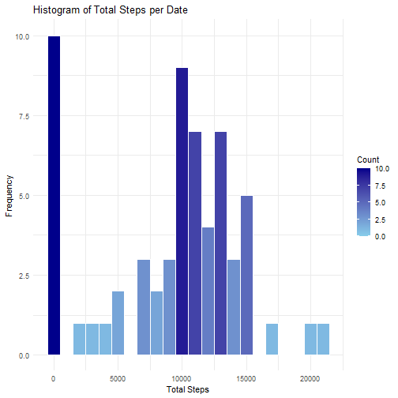
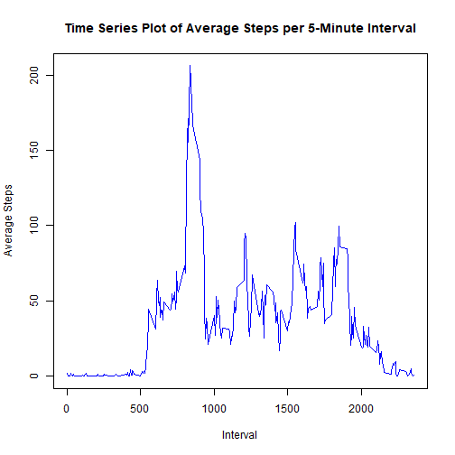
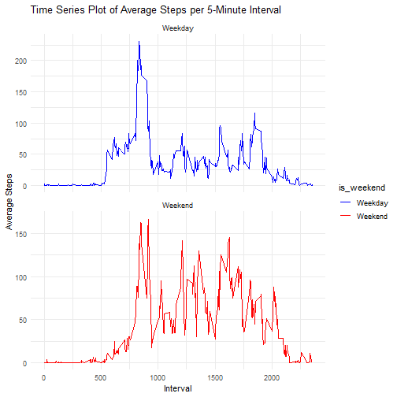

loading libraries

```r
library(dplyr)
library(ggplot2)
library(lubridate)
```
## loading and preparing data

```r
data<-read.csv('C:\\Users\\Talila\\BOI\\coursera R\\Repro_research_ course 5\\data\\activity.csv')
data$steps=as.numeric(data$steps)
data$date= as.Date(data$date, format = "%d/%m/%Y")
```


## q1: What is mean total number of steps taken per day?
Calculate the total number of steps taken per day


```r
total_steps_per_date= data %>% 
                      group_by(date)%>%
                      summarise(total_steps=sum(steps,na.rm=TRUE))
```
Making a histogram of the total number of steps taken each day

```r
ggplot(total_steps_per_date, aes(x = total_steps, fill = ..count..)) +
  geom_histogram(binwidth = 1000, color = "white", aes(y = ..count..)) +
  scale_fill_gradient("Count", low = "skyblue", high = "darkblue") +
  labs(title = "Histogram of Total Steps per Date",
       x = "Total Steps",
       y = "Frequency") +
  theme_minimal()
```



Calculate and report the mean and median of the total number of steps taken per day

```r
mean_steps=mean(total_steps_per_date$total_steps)
median_steps=median(total_steps_per_date$total_steps)
```

The daily steps mean is:              9354.23.
The daily steps median is:                10395


## Q2 What is the average daily activity pattern?
preparing data:

```r
avg_steps_per_interval= data %>% 
  group_by(interval)%>%
  summarise(average_steps_interval=mean(steps,na.rm=TRUE))
```
Make a time series plot :

```r
plot(avg_steps_per_interval$interval, avg_steps_per_interval$average_steps_interval,
     type = "l", col = "blue",
     main = "Time Series Plot of Average Steps per 5-Minute Interval",
     xlab = "Interval", ylab = "Average Steps")
```



 interval that contains the maximal number of steps

```r
maximal_num_of_steps=avg_steps_per_interval$interval[which.max(avg_steps_per_interval$average_steps_interval)]
```
the interval that contains the maximal number of steps:                 835

## Q3 Imputing missing values
total number of missing values

```r
tot_na=sum(is.na(data$steps))
```
total number of missing values in steps is                 2304

filling-in NAs with the interval's avg:

```r
data_no_NAs <- data %>%
  left_join(avg_steps_per_interval, by = "interval") %>%
  mutate(steps = ifelse(is.na(steps), average_steps_interval, steps)) %>%
  select(-average_steps_interval)
```

Histogram (after calculating imputed_data_total_steps_per_date), mean ,median of imputed data

```r
imputed_data_total_steps_per_date= data_no_NAs %>% 
  group_by(date)%>%
  summarise(total_steps=sum(steps,na.rm=TRUE))

ggplot(imputed_data_total_steps_per_date, aes(x = total_steps, fill = ..count..)) +
  geom_histogram(binwidth = 1000, color = "white", aes(y = ..count..)) +
  scale_fill_gradient("Count", low = "skyblue", high = "darkblue") +
  labs(title = "Histogram of Total Steps per Date (NAs are imputed)",
       x = "Total Steps",
       y = "Frequency") +
  theme_minimal()
```


```r
mean_steps_no_NAs=mean(imputed_data_total_steps_per_date$total_steps)
median_steps_no_NAs=median(imputed_data_total_steps_per_date$total_steps)
```
The new mean  after imputing data:
The NEW daily steps mean is:             10766.19.
The  NEW daily steps median is also :             10766.19
The values are the same. the imputation made a more centrelized distribution.

## Q4 Are there differences in activity patterns between weekdays and weekends?

create an indicator for weekend

```r
wd_data <- data_no_NAs %>%
  mutate(weekday = wday(date, label = TRUE, week_start = 1, locale = "en_US")) %>%
  mutate(is_weekend = ifelse(weekday %in% c("Sat", "Sun"), "Weekend", "Weekday"))
```
prepare data  for time series plot panel by is_weekend

```r
  avg_steps_weekend_per_interval= wd_data %>% 
  group_by(is_weekend, interval)%>%
  summarise(average_steps_interval=mean(steps,na.rm=TRUE))
```
display the plot

```r
ggplot(avg_steps_weekend_per_interval, aes(x = interval, y = average_steps_interval, col = is_weekend)) +
  geom_line() +
  facet_wrap(~is_weekend, scales = "free_y", ncol = 1) +
  labs(title = "Time Series Plot of Average Steps per 5-Minute Interval",
       x = "Interval",
       y = "Average Steps") +
  scale_color_manual(values = c("blue", "red")) +
  theme_minimal()
```



There definitely seems to be a difference between the steps during the week Vs Weekdays.There is clearly more activity during weekends.
